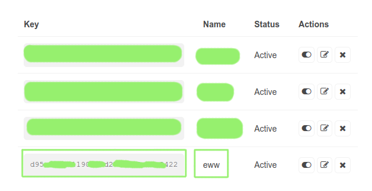

# exodia-eww
EWW widgets for Exodia OS

<h3 align="center"> Keybinding ⌨️  </h3>

mod -> super (window key)

| Keys | Action |
| --- | --- |
| <kbd>mod + d</kbd> | Open/Close eww |


# Tips 

### configure mail script
- open [google App passwords](https://myaccount.google.com/apppasswords)

- from `Select app` choice `Other(Custom name)`, set name (e.g`eww`) and copy the code


- edit `~/.config/eww/dashboard/scripts/mails`

- change values of `obj.login('YourUserName@gmail.com','password')`

e.g

```python
#!/bin/python

import imaplib
obj = imaplib.IMAP4_SSL('imap.gmail.com',993)
obj.login('mm****@gmail.com','thb***')
obj.select()
print(len(obj.search(None, 'UnSeen')[1][0].split()))

```


#

### configure Weather script

- visit [openweathermap](https://openweathermap.org/) and create an account

- get your [API-Kye](https://home.openweathermap.org/api_keys)

- set name like `eww` then generate the key




- copy the key

- edit `~/.config/eww/dashboard/scripts/weather_info` and set `KEY` (line No. 13).

```bash
KEY=57f757c35e2fc8************
```

- git your city id from `search` find your city (e.g Giza)


- prees on `Giza`


- form `url` you can get city id 


- edit `~/.config/eww/dashboard/scripts/weather_info` and set `ID` (line No. 15).

```bash
ID=360995  
```